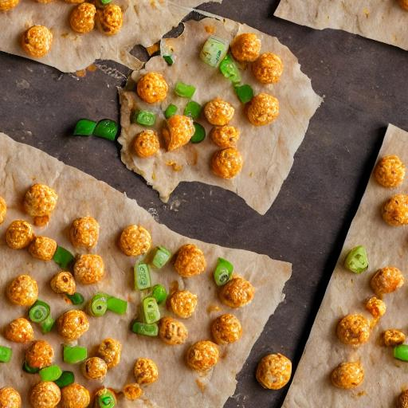

# replicate-seamless-texture-builder

Get an API-Token from https://replicate.com/

Use this token whereas you type in your terminal: `export REPLICATE_API_TOKEN=yourtokengoeshere`

Start with the pythonscript main.py and type in your Terminal as follows `python3 main.py`.
Then the fun part begins. Give free rein to your imagination.

After entering you prompt, AI seamless texture is generated. It takes about 30 seconds and the link will be merged into my database. E.g.: 

the prompt `rusty nails and cheeseballs with green pepper pizza slices` generated

Adam Abundis created this wonderful template (https://codepen.io/adamabundis/pen/PoYgvYQ) I use for infinite scrolling background. You just need to open this file in your browser: `pattern-animation-infinite/dist/index.html`

Future plans:
I'm planning this admin-interface for storing and recalling allready generated textures here: [bildstrecke.ch/admin]()

Have fun.

